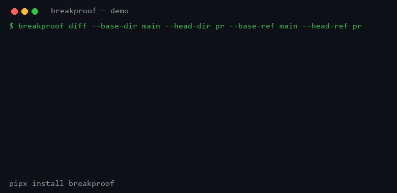

# Breakproof — merge without fear.

[](https://github.com/auditscan-sh/breakproof/actions)
[](https://pypi.org/p/breakproof/)


Your PR deleted an endpoint someone still calls. Breakproof tells you before your users do. No OpenAPI spec, no config novel, no noise. Removed contracts fail. Everything else passes.



```bash
pipx install breakproof
breakproof scan ./app --out base.json
breakproof diff --base base.json --head-dir ./pr-branch
# verdict=fail, exit 1, and a Markdown receipt of exactly what vanished
```

## Install

```bash
pipx install breakproof   # CLI, isolated. The good default.
pip install breakproof    # library + CLI in your venv.
uvx breakproof --help     # no install at all, just vibes.
```

Python 3.10+. Zero dependencies. No network, no telemetry, no account. It works on a plane.

## CLI

```bash
# Freeze a directory into a contract
breakproof scan ./app --out contract.json
breakproof scan ./app --service payments --out contract.json

# Diff two frozen contracts
breakproof diff --base base.json --head head.json

# Diff two directories directly (the 10-second demo)
breakproof diff --base-dir ./main --head-dir ./pr

# Save the receipts instead of printing them
breakproof diff --base base.json --head head.json \
  --out-gate gate.json --markdown gate.md --radar-markdown radar.md
```

Exit codes: `0` pass, `1` fail (something vanished), `2` you invoked it wrong.

Contract JSON looks like this. You can hand-write it, generate it, or freeze it in CI — Breakproof doesn't care where it came from:

```json
{
  "endpoints": [
    {"method": "GET", "path": "/users", "protocol": "http",
     "service": "api", "handler": "", "file": "app.py", "line": 12}
  ],
  "edges": []
}
```

## Library (yes, it's importable)

Same gate your CI runs, inside your own Python:

```python
from breakproof.extract import scan_path
from breakproof.prgate import build_gate, render_gate_markdown

base = scan_path("./main")
head = scan_path("./pr")
gate = build_gate(base, head, base_ref="main", head_ref="pr")

print(gate["verdict"])  # "pass" | "fail"
print(render_gate_markdown(gate))  # paste it into a PR comment
```

Lower level, if you already have contracts:

```python
from breakproof.radar import build_api_diff

diff = build_api_diff(base, head)
print(diff["summary"])  # {"removed": 1, "added": 0, ..., "breaking": 1}
```

## CI

```yaml
- uses: auditscan-sh/breakproof@v1
  with:
    base-dir: ./base
    head-dir: .
```

Posts the verdict to the run summary. Set `fail-on-breaking: "false"` for advisory mode (comments, never red).

## Why not a spec diff?

Spec tools need an `openapi.yaml` you have to write and keep honest, then flag everything including stuff nobody calls. Breakproof reads your code, freezes what it serves, and fails only on removals — plus new CVEs or secret sites if you hand it those lists as JSON. Nothing to maintain, nothing to triage, nothing to argue about in review.

## Scans three languages out of the box

Python, JavaScript/TypeScript, Go — see [examples/](examples/) (a Flask API, an Express API, a Go API). One command freezes all three into a single contract:

```bash
breakproof scan ./my-monorepo --out contract.json
# endpoints=8 across python-api, express-api, go-api
```

## Honest limits

v0.1 recognizes common Flask, FastAPI, Express, Fiber, Go `net/http`, and Gin route patterns. Anything exotic reports zero endpoints instead of inventing some — run `breakproof scan` and eyeball the count before you gate on it. Standalone caller lists read `none observed`; pair it with a scanner that knows your consumers to name names.

## Safety

Read-only by design. It never deletes, moves, edits, or executes your code — it reads the directories you point it at and writes exactly the files you name with `--out` / `--markdown`. Symlinks skipped, files over 1 MB skipped, scans cap at 50k files / 20k endpoints.

## License

MIT. Break things responsibly.

Built by [AuditScan](https://auditscan.sh).
